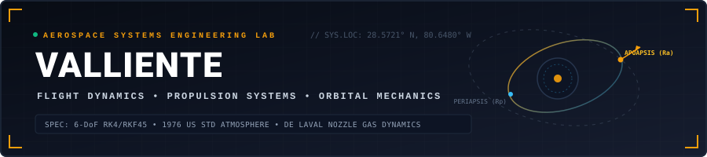

  

  
  
  
  

 

Aerospace engineer specializing in numerical flight trajectory integration, supersonic propulsion, compressible gas dynamics, and orbital mechanics. Developing computational simulation engines, flight dynamics solvers, and real-time telemetry workstations across atmospheric ascent and orbital transfer regimes.

---

### Telemetry & Flight Activity

  
  

  

---

### Core Aerospace Disciplines & Mathematical Solvers

- **Atmospheric Flight Dynamics & 6-DoF Kinematics**:
  - Numerical state integration $[\mathbf{r}, \mathbf{v}, \boldsymbol{\omega}, \mathbf{q}, m]$ via 4th-order Runge-Kutta (RK4) and adaptive Runge-Kutta-Fehlberg (RKF45).
  - 1976 US Standard Atmosphere piecewise barometric modeling (geopotential altitude up to 86 km).
  - Mach-dependent aerodynamic drag polar curves ($C_D(\text{Mach})$ across subsonic, transonic, and supersonic regimes).

- **Rocket Propulsion & Compressible Gas Dynamics**:
  - Multi-stage Tsiolkovsky delta-v mission staging: $\Delta v = \sum I_{\text{sp},i} \cdot g_0 \ln(m_{0,i} / m_{f,i})$.
  - Isentropic compressible flow through de Laval converging-diverging nozzles:
    $$\frac{A}{A^*} = \frac{1}{M}\left[\frac{2}{\gamma+1}\left(1 + \frac{\gamma-1}{2}M^2\right)\right]^{\frac{\gamma+1}{2(\gamma-1)}}$$
  - Shock diamond formation, pressure thrust adjustment, and under/over-expansion altitude compensation.

- **Orbital Mechanics & Astrodynamics**:
  - Keplerian two-body orbit propagation, orbital elements state conversion, and orbital energy conservation.
  - Circular Restricted Three-Body Problem (CR3BP) invariant manifolds and Lagrange point mechanics ($L_1 - L_5$).
  - Powered Explicit Guidance (PEG) for optimal exo-atmospheric orbital injection.

- **High-Performance Simulation Architecture**:
  - Deterministic physics loops running in native C++20 and Rust with WebAssembly SIMD hardware acceleration.
  - Multi-platform desktop & mobile distribution using Qt 6 (Quick 3D), Tauri v2, and GPU-accelerated WebGL telemetry pipelines.

---

### Featured Aerospace & Engineering Systems

| Project | Description | Architecture & Stack |
| :--- | :--- | :--- |
| [**AeroPro: Rocketry & Propulsion Studio**](https://github.com/valliente/aeropro-rocketry-studio) | Complete aerospace rocketry and propulsion studio with 1976 US Standard Atmosphere, multi-stage Tsiolkovsky solver, 2-DoF RK4 flight integrator, and isentropic nozzle visualizer. | Tauri v2, Rust WASM, React 19, Three.js, TypeScript |
| [**CRISPR Target Designer**](https://github.com/valliente/crispr-target-designer) | Standalone desktop bioinformatics workbench for multi-nuclease gRNA design, double-strand break mapping, Hsu-Zhang mismatch scoring, and Golden Gate cloning oligo synthesis. | Python 3.11, PyQt6, Biopython |
| [**LagForge**](https://github.com/valliente/lagforge) | Windows network conditioner and latency simulator featuring kernel-level WinDivert packet filtering, Gaussian jitter, packet loss injection, and zero-drop teardown. | Python, PySide6, WinDivert, Win32 API |
| [**Microbot Evolution Lab**](https://github.com/valliente/microbot-evolution-lab) | Autonomous artificial life and genetic evolution simulation featuring rule-based vector steering, asexual reproduction with trait mutation, and O(1) spatial hash grids. | TypeScript, React 18, HTML5 Canvas, WebGL |
| [**Ghost Runner**](https://github.com/valliente/ghost-runner) | Hybrid 2D side-scrolling fitness engine featuring real-time GPS Kalman filtering, WebRTC P2P ghost racing, and multi-track Tone.js audio synthesis. | Phaser 3, Tone.js, Tauri v2, Capacitor, TypeScript |
| [**Horology Studio 3D**](https://github.com/valliente/horology-studio-3d) | Native desktop customizer for 3D luxury mechanical watches with dynamic dial texture mapping and PBR sapphire and steel shaders. | C++20, Qt 6 Quick 3D, QML, CMake |
| [**Micro Timegrapher**](https://github.com/valliente/micro-timegrapher) | Acoustic mechanical watch diagnostic workstation with WASM DSP autocorrelation, acoustic telemetry capture, and positional rate analysis. | WASM, WebAudio DSP, React, TypeScript |
| [**Cellular Pathway Simulator**](https://github.com/valliente/cellular-pathway-simulator) | Interactive biochemistry metabolic pathway simulator with enzymatic reaction kinetics, node-graph pathway visualization, and flux analytics. | React, React Flow, TypeScript, Zustand |

---

### Computational Toolchain & Engineering Stack

  

 

| Domain | Frameworks, Engines & Languages | Key Capabilities |
| :--- | :--- | :--- |
| **Flight Dynamics & Numerical Integration** | `C++20` `Rust` `Python` `NumPy` `SciPy` `WASM SIMD` | 2-DoF / 6-DoF RK4/RKF45 integrators, quaternion kinematics, 1976 US Standard Atmosphere, aerodynamic drag polars ($C_D(\text{Mach})$). |
| **Rocket Propulsion & Gas Dynamics** | `Rust` `C++20` `TypeScript` `Tauri v2` | Multi-stage Tsiolkovsky delta-v solver, isentropic converging-diverging nozzle expansion, shock diamond visualizer. |
| **Astrodynamics & Orbit Propagation** | `Python` `C++20` `WebGL` `Three.js` | Keplerian state propagation, circular restricted three-body problem (CR3BP), Powered Explicit Guidance (PEG). |
| **Avionics UI & Telemetry Visualization** | `Qt 6 (Quick 3D)` `QML` `Tauri v2` `React 19` `Phaser 3` | Hardware-accelerated 60 FPS flight gauges, PBR shaders, real-time GPS Kalman filtering, WebAudio DSP autocorrelation. |
| **Systems & Platform Engineering** | `CMake` `MSVC` `Win32 API` `WinDivert` `Linux` `Git` | Native standalone zero-dependency compilation, kernel-level packet filtering, automated CI/CD multi-architecture release pipelines. |
